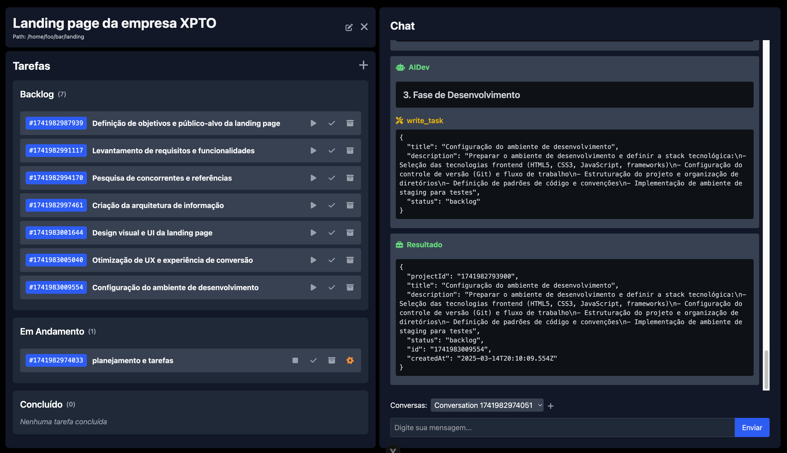

# AIDev: Automatize seus Projetos com IA

**Uma ferramenta para automatizar tarefas de projetos com o poder da Inteligência Artificial, diretamente no seu
computador.**

**🚀 Crie. Automatize. Inove.**

## O que é AIDev?

AIDev é uma ferramenta inovadora inspirada em gerenciadores de projetos como Scrum, mas com um foco revolucionário: *
*automatizar a execução de tarefas dentro dos seus projetos usando assistentes de Inteligência Artificial (LLMs).**

Imagine poder delegar tarefas complexas e repetitivas para a IA, aumentando sua produtividade e liberando você para se concentrar no que realmente importa: a
**criação e a inovação.**

Com AIDev, você pode:

* **Organizar seus projetos:
  ** Crie projetos e defina tarefas de forma clara e estruturada, como em um gerenciador de projetos tradicional.
* **Potencializar com IA:
  ** Integre assistentes de IA de ponta (OpenAI, Anthropic, Google) para executar as tarefas definidas em seus projetos.
* **Automatizar tarefas:
  ** Defina tarefas que são executadas automaticamente pela IA, desde geração de código e textos até organização de arquivos e muito mais.
* **Multitarefas e Multi-projetos:
  ** Execute múltiplas tarefas simultaneamente e gerencie diversos projetos abertos ao mesmo tempo, otimizando seu fluxo de trabalho.

**💡 Para quem é o AIDev?**

AIDev é perfeito para:

* **Desenvolvedores:** Automatize tarefas de codificação, testes, documentação e deploy.
* **Escritores e Criadores de Conteúdo:** Gere rascunhos, revise textos, crie resumos e organize sua pesquisa.
* **Gestores de Projetos:** Automatize o acompanhamento de tarefas, geração de relatórios e comunicação com equipes.
* **Qualquer pessoa** que busca automatizar tarefas em seu computador e aumentar a produtividade com o poder da IA.

## Funcionalidades Principais ✨

* **Criação de Projetos:** Organize seu trabalho em projetos distintos, mantendo tudo estruturado.
* **Assistentes Inteligentes:
  ** Defina e configure assistentes de IA (com suporte para OpenAI, Anthropic e Google) para cada projeto ou tarefa.
* **Criação de Tarefas:
  ** Defina tarefas claras e objetivas dentro de cada projeto, especificando o que precisa ser feito.
* **Execução Automática de Tarefas:
  ** Deixe a IA trabalhar! Execute tarefas individualmente ou em lote, liberando seu tempo.
* **Execução Simultânea:** Aumente sua eficiência executando múltiplas tarefas ao mesmo tempo.
* **Multi-Projetos Abertos:** Trabalhe em diversos projetos simultaneamente, sem perder o foco.
* **Integração com LLMs:** Compatível com as principais APIs de IA do mercado: OpenAI, Anthropic e Google.

## Começando a Usar 🚀

Está pronto para começar a automatizar seus projetos com AIDev? Siga estes passos simples para executar o AIDev localmente:

**Estrutura do Projeto:**

O AIDev é composto por dois projetos distintos:

* **AIDev-Backend:** Contém a API e a lógica de negócios do sistema. Está localizado no diretório `backend`.
* **AIDev-Frontend:** Contém a interface de usuário e componentes visuais. Está localizado no diretório `frontend`.

**Pré-requisitos:**

* **Node.js e NPM (Gerenciador de Pacotes do Node.js) Instalados:
  ** AIDev utiliza Node.js e NPM. Se você não os tiver instalados, siga as instruções em [https://nodejs.org/](https://nodejs.org/) para instalar a versão mais recente recomendada.

**Instalação:**

### Scripts de Instalação Automática

Para uma instalação mais rápida e automatizada, você pode usar o script `install,sh`. Este script irá instalar as
dependências necessárias tando do backend quanto do frontend.

**Execução:**

### Script de Execução

Para iniciar o AIDev, você pode usar o script `run.sh`. Este script irá iniciar o projeto e disponibilizará ele
através do endereço `http://localhost:3030`. Este é o endereço padrão do frontend. Caso você tenha alterado a porta
do backend no arquivo `.env` dentro da pasta `backend`, utilize a porta configurada por você no lugar de `3030`.

Parabéns! O AIDev deve estar rodando localmente na sua máquina pronto para ser usado.

**Observações Importantes:**

* **Terminal Aberto:
  ** Mantenha o terminal aberto enquanto estiver usando o AIDev localmente, pois ele é
  necessário para a aplicação funcionar.
* **Arquivos `.env`:
  ** Consulte o arquivo `.env` nas pastas `backend` para verificar e configurar a porta e
  outras opções de configuração.
* **Erros?
  ** Se você encontrar algum erro durante a instalação ou execução, verifique se você seguiu todos os passos corretamente, se tem os pré-requisitos instalados e se as configurações nos arquivos `.env` estão corretas. Consulte a seção de [
  **Solução de Problemas (a adicionar)**](#solucao-de-problemas) ou abra uma **Issue
  ** neste repositório para pedir ajuda.

## Contribuições 🤝

Sua ajuda é muito bem-vinda!  AIDev é um projeto open-source e ficaremos muito felizes com suas contribuições.

Você pode contribuir de diversas formas:

* **Desenvolvimento de Funcionalidades:**  Adicione novas funcionalidades, otimize o código existente, corrija bugs.
* **Documentação:** Melhore a documentação, crie tutoriais, traduza o README para outros idiomas.
* **Testes:**  Crie e execute testes para garantir a qualidade e estabilidade do projeto.
* **Design:**  Contribua com melhorias na interface e experiência do usuário.
* **Ideias e Sugestões:** Compartilhe suas ideias para novas funcionalidades e melhorias.

**Como Contribuir:**

1. Faça um **Fork** do repositório.
2. Crie uma **Branch** com sua contribuição (ex: `feature/nova-funcionalidade` ou `fix/bug-na-tarefa`).
3. Faça suas modificações e envie **Commits** claros e descritivos.
4. Envie um **Pull Request** para a branch `main` do repositório original.

**Reportando Bugs e Sugestões:**

Se encontrar algum bug ou tiver sugestões de melhorias, por favor, abra uma **Issue** neste repositório.

## Próximos Passos e Funcionalidades Futuras 🛣️

Estamos trabalhando constantemente para melhorar o AIDev e adicionar novas funcionalidades incríveis, como:

* **Integração com Browser:
  ** Permitir que assistentes de IA interajam com navegadores web para automatizar tarefas online.
* **Referências Baseadas em URLs:
  **  Permitir que tarefas e assistentes utilizem referências diretas a URLs para dados e informações externas.

## Licença 📄

AIDev é distribuído sob a licença [Apache License 2.0](https://opensource.org/licenses/Apache-2.0).
